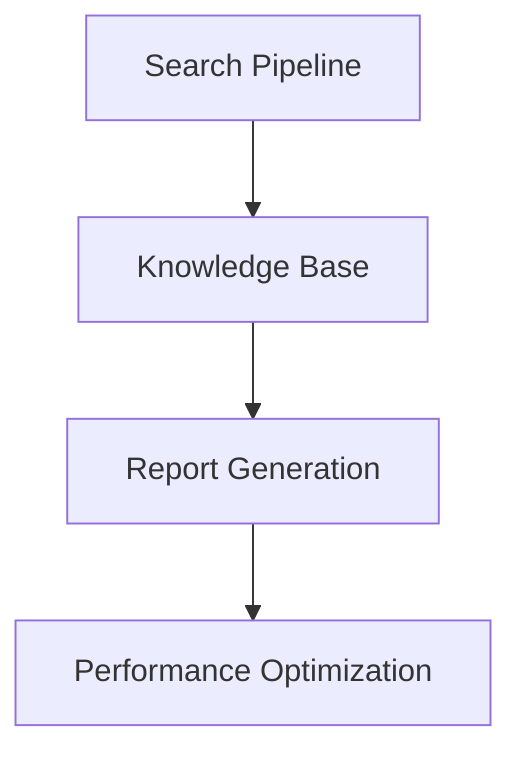

# NanoSage Active Context

## Current Status
Memory bank initialization completed with core documentation:
- Project brief established
- Product context defined
- System patterns documented
- Technical context outlined

## Recent Changes
Initial project setup with core files:
1. Main search pipeline implementation
2. Knowledge base system
3. Web search integration
4. Report generation

## Active Decisions

### 1. Architecture Decisions
- Adoption of pipeline pattern for search flow
- Implementation of composite pattern for TOC
- Use of async processing for web operations
- Integration of Monte Carlo sampling for search

### 2. Technical Choices
- Gemma 2B as primary LLM
- PyTorch for ML operations
- Async web search implementation
- Local-first processing approach

### 3. Implementation Focus
- Efficient memory management
- Scalable search patterns
- Robust error handling
- Clear documentation structure

## Current Priorities

### 1. Core Functionality

- Refine search algorithms
- Enhance relevance scoring
- Improve report formatting
- Optimize resource usage

### 2. Documentation
- API documentation
- Usage examples
- Configuration guide
- Deployment instructions

### 3. Testing
- Unit test coverage
- Integration testing
- Performance benchmarks
- Error case validation

## Next Steps

### Immediate Tasks
1. Implement configuration validation
2. Add logging system
3. Create usage examples
4. Document API endpoints

### Short-term Goals
1. Performance optimization
2. Enhanced error handling
3. Additional model support
4. Web search improvements

### Medium-term Objectives
1. Advanced report formatting
2. Extended document support
3. Search algorithm refinement
4. User interface options

## Active Considerations

### 1. Performance
- Memory usage optimization
- Processing efficiency
- Search result quality
- Report generation speed

### 2. Reliability
- Error recovery
- Data consistency
- Search accuracy
- System stability

### 3. Usability
- Configuration simplicity
- Clear documentation
- Intuitive interfaces
- Helpful feedback

## Development Focus

### Current Sprint
1. Core functionality stabilization
2. Performance optimization
3. Documentation enhancement
4. Testing implementation

### Upcoming Work
1. Advanced features
2. Additional models
3. UI improvements
4. Integration options

## Known Issues

### 1. Technical Challenges
- Memory management for large documents
- Search depth optimization
- Model loading efficiency
- Web search rate limiting

### 2. Areas for Improvement
- Report formatting options
- Search relevance tuning
- Configuration flexibility
- Error messaging

## Recent Learnings

### 1. Technical Insights
- Efficient embedding strategies
- Effective TOC generation
- Optimal chunk sizing
- Resource management patterns

### 2. Implementation Findings
- Search pattern effectiveness
- Report structure optimization
- Memory usage patterns
- Error handling strategies

## Active Experiments

### 1. Search Optimization
- Monte Carlo sampling refinement
- Relevance scoring improvements
- Depth control strategies
- Result filtering methods

### 2. Performance Testing
- Memory profiling
- Processing benchmarks
- Search efficiency
- Report generation speed

## Collaboration Points

### 1. Community Input
- Feature requests
- Bug reports
- Performance feedback
- Usage patterns

### 2. Integration Opportunities
- Additional models
- New data sources
- Export formats
- Tool integration

This active context document reflects the current state of NanoSage development and guides ongoing work. It should be updated regularly as the project evolves.
