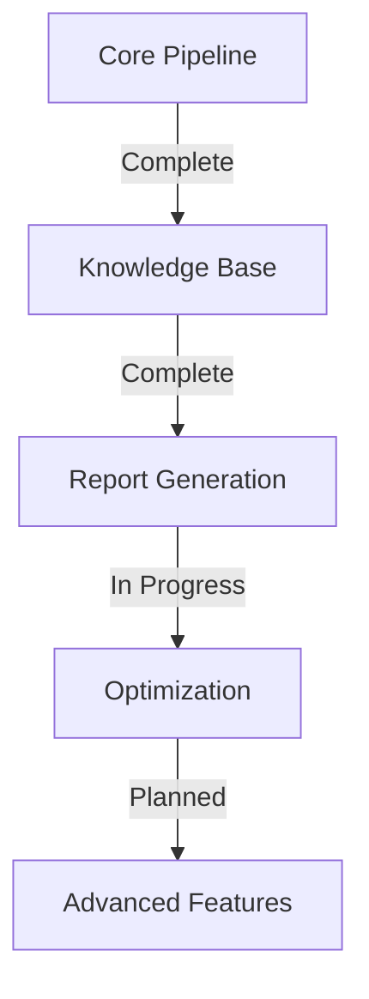

# NanoSage Progress Tracker

## What Works

### 1. Core Search Pipeline
✅ Query enhancement with chain-of-thought
✅ Monte Carlo-based subquery sampling
✅ Relevance-driven search pruning
✅ Recursive search expansion
✅ Local and web document integration

### 2. Knowledge Management
✅ Document embedding generation
✅ Knowledge base construction
✅ Efficient document retrieval
✅ Context preservation
✅ Relevance scoring

### 3. Report Generation
✅ TOC-based structure
✅ Markdown formatting
✅ Citation tracking
✅ Web result grouping
✅ Local result integration

### 4. Model Integration
✅ Gemma 2B integration
✅ Ollama model serving
✅ CPU/GPU support
✅ Efficient inference
✅ Model selection options

## What's Left to Build

### 1. Core Enhancements
- [ ] Advanced configuration validation
- [ ] Comprehensive logging system
- [ ] Extended error handling
- [ ] Progress visualization
- [ ] Performance monitoring

### 2. Search Improvements
- [ ] Advanced relevance tuning
- [ ] Additional search strategies
- [ ] Enhanced depth control
- [ ] Result filtering options
- [ ] Cache management

### 3. Documentation
- [ ] API documentation
- [ ] Configuration guide
- [ ] Deployment manual
- [ ] Contributing guidelines
- [ ] Performance tuning guide

### 4. Testing
- [ ] Unit test suite
- [ ] Integration tests
- [ ] Performance benchmarks
- [ ] Error case coverage
- [ ] Load testing

## Current Status

### 1. Implementation Status

### 2. Component Status
| Component | Status | Notes |
|-----------|---------|-------|
| Query Enhancement | ✅ Complete | Working with chain-of-thought |
| Search Pipeline | ✅ Complete | Implements Monte Carlo sampling |
| Knowledge Base | ✅ Complete | Supports local and web docs |
| Report Generation | ✅ Complete | Markdown with TOC structure |
| Model Integration | ✅ Complete | Gemma 2B primary model |
| Configuration | 🟡 Partial | Basic support implemented |
| Testing | 🔴 Planned | Framework needed |
| Documentation | 🟡 Partial | Core docs available |

## Known Issues

### 1. Technical Issues
1. Memory Management
   - Large document handling needs optimization
   - Embedding storage efficiency
   - Batch processing improvements

2. Search Performance
   - Web search rate limiting
   - Depth vs breadth balance
   - Result relevance tuning

3. Model Integration
   - Model loading time
   - Inference optimization
   - Resource usage patterns

### 2. Feature Gaps
1. Configuration
   - Limited validation
   - Missing advanced options
   - Default value handling

2. Error Handling
   - Basic implementation
   - Missing recovery strategies
   - Limited feedback

3. Documentation
   - API docs needed
   - Missing examples
   - Setup guide incomplete

## Recent Progress

### Last Update: 2/12/2025
1. Completed
   - Core pipeline implementation
   - Knowledge base system
   - Report generation
   - Model integration

2. In Progress
   - Performance optimization
   - Documentation expansion
   - Error handling improvements
   - Configuration system

3. Planned Next
   - Testing framework
   - Advanced features
   - UI improvements
   - Integration options

## Roadmap

### Short Term (1-2 Months)
1. Core Stability
   - Performance optimization
   - Error handling
   - Configuration system
   - Basic testing

2. Documentation
   - API documentation
   - Usage examples
   - Setup guides
   - Contributing guidelines

### Medium Term (3-6 Months)
1. Advanced Features
   - Additional models
   - Search improvements
   - UI development
   - Integration options

2. Testing & Quality
   - Test coverage
   - Performance benchmarks
   - Error validation
   - Load testing

### Long Term (6+ Months)
1. Ecosystem
   - Plugin system
   - Additional integrations
   - Community features
   - Advanced UI

2. Scale & Performance
   - Distributed processing
   - Advanced caching
   - Resource optimization
   - Performance tuning

## Success Metrics

### 1. Performance
- Query processing time
- Memory usage
- Search accuracy
- Report generation speed

### 2. Quality
- Search relevance
- Report organization
- Error handling
- User feedback

### 3. Adoption
- GitHub stars
- Active users
- Community contributions
- Feature requests

This progress tracker will be updated regularly to reflect the current state of NanoSage development and guide future work.
