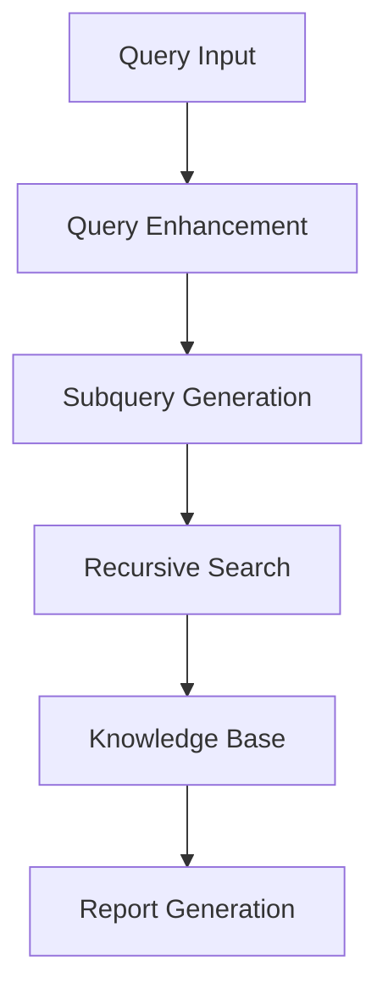
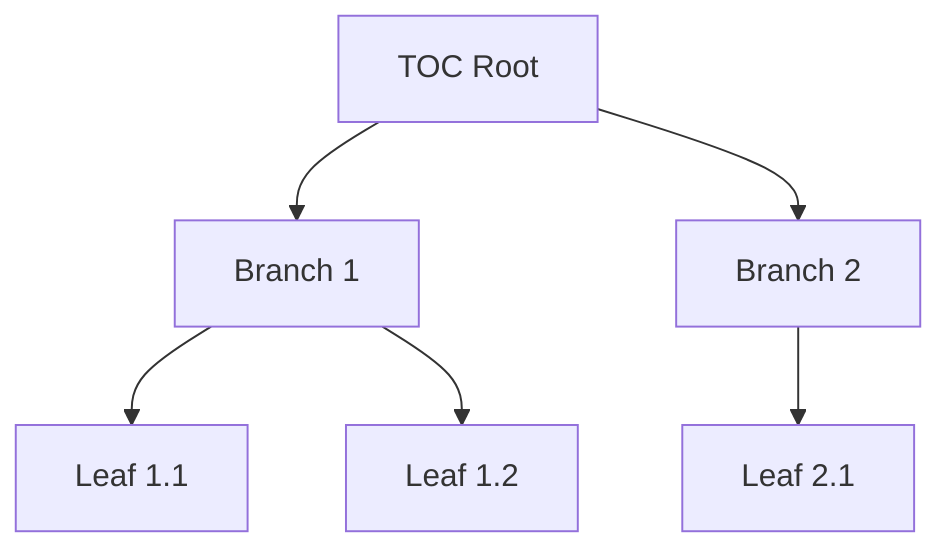
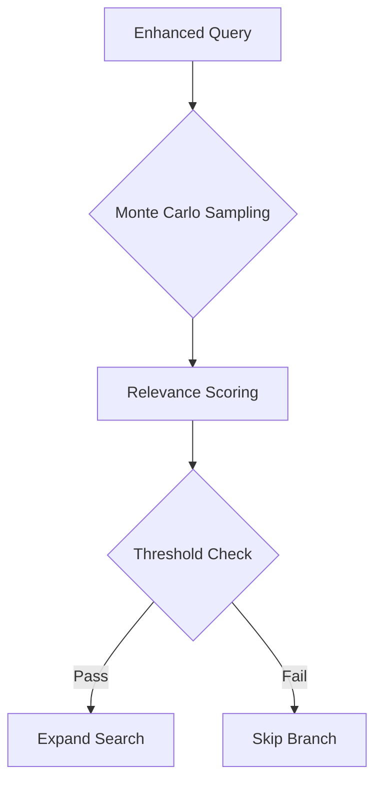
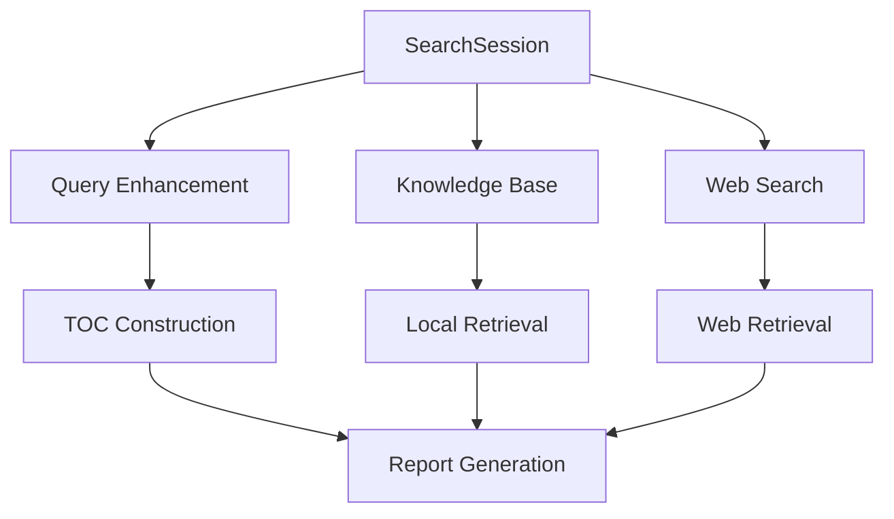
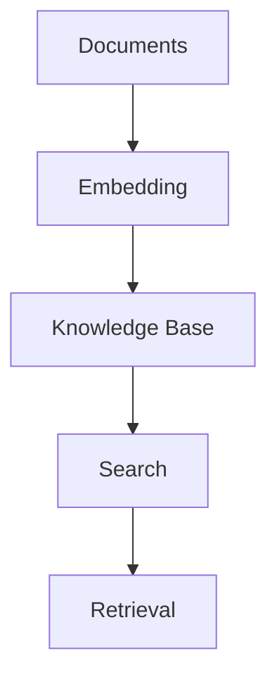
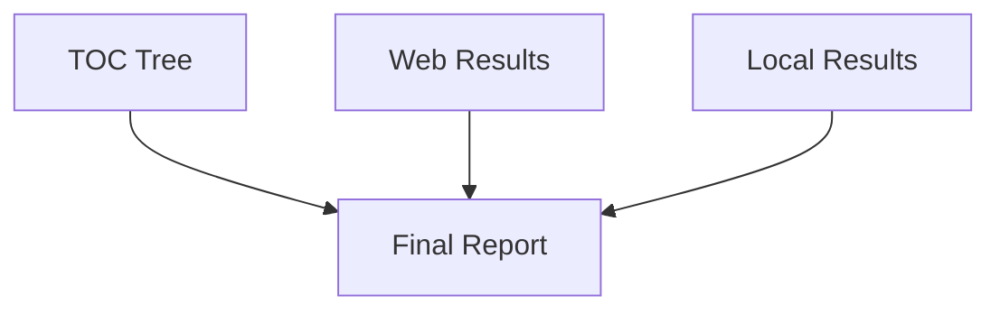
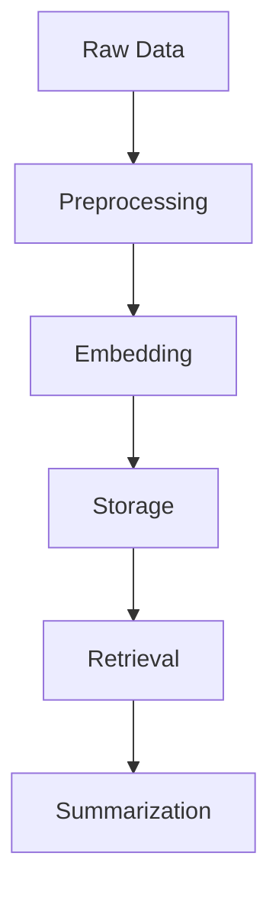

# NanoSage System Patterns

## Architecture Overview

### Core Components
1. **SearchSession Orchestrator**
   - Central controller managing the entire search pipeline
   - Handles initialization, search execution, and result aggregation
   - Maintains state through query lifecycle

2. **Knowledge Base**
   - Document storage and retrieval system
   - Embedding-based search capabilities
   - Supports both local and web documents

3. **TOC Tree**
   - Hierarchical representation of search paths
   - Tracks relevance scores and summaries
   - Guides report structure

## Design Patterns

### 1. Pipeline Pattern

- Sequential processing stages
- Clear data flow between components
- Modular stage implementation

### 2. Composite Pattern (TOC Tree)

- TOCNode structure for search hierarchy
- Recursive composition of search results
- Maintains parent-child relationships

### 3. Strategy Pattern
- Configurable retrieval models
- Pluggable RAG implementations
- Flexible search strategies

### 4. Factory Pattern
- Model loading and initialization
- Document embedding creation
- Result aggregation

## Key Technical Decisions

### 1. Embedding Architecture
- Late interaction scoring for relevance
- Efficient document representation
- Model-agnostic design

### 2. Search Strategy

- Monte Carlo subquery sampling
- Relevance-based pruning
- Depth-limited recursion

### 3. Resource Management
- Configurable device targeting (CPU/GPU)
- Chunked text processing
- Efficient memory usage

### 4. Model Integration
- Local model deployment (Gemma 2B)
- Ollama integration
- Flexible model selection

## Component Relationships

### 1. Search Session Flow

### 2. Knowledge Base Integration

### 3. Report Generation Pipeline

## Implementation Patterns

### 1. Async Processing
- Asynchronous web searches
- Concurrent document processing
- Non-blocking operations

### 2. Error Handling
- Graceful degradation
- Robust web scraping
- Safe embedding generation

### 3. Configuration Management
- YAML-based configuration
- Command-line arguments
- Environment-aware settings

### 4. Data Flow

## System Constraints

### 1. Resource Limitations
- Memory-aware processing
- Configurable batch sizes
- Device-specific optimizations

### 2. Model Constraints
- Small model focus
- Local execution
- Efficient inference

### 3. Search Boundaries
- Depth limits
- Relevance thresholds
- Result count caps

## Evolution Patterns

### 1. Extensibility Points
- Model integration interface
- Search strategy plugins
- Report format customization

### 2. Scalability Considerations
- Modular component design
- Configurable resource usage
- Flexible deployment options

### 3. Maintenance Patterns
- Clear component boundaries
- Consistent error handling
- Comprehensive logging

This document captures the key architectural patterns and design decisions in NanoSage, serving as a reference for understanding and extending the system.
