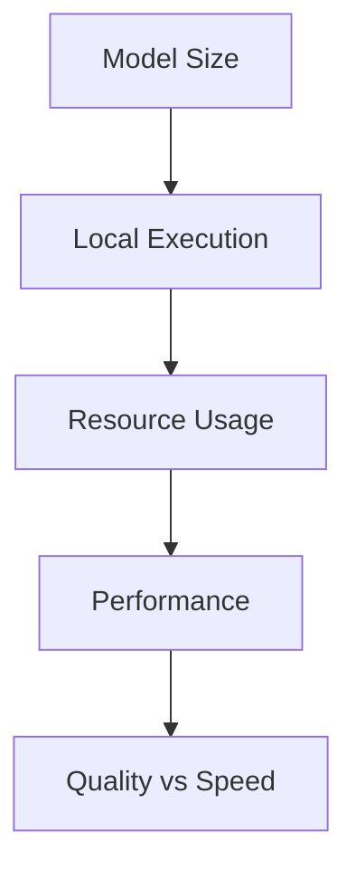
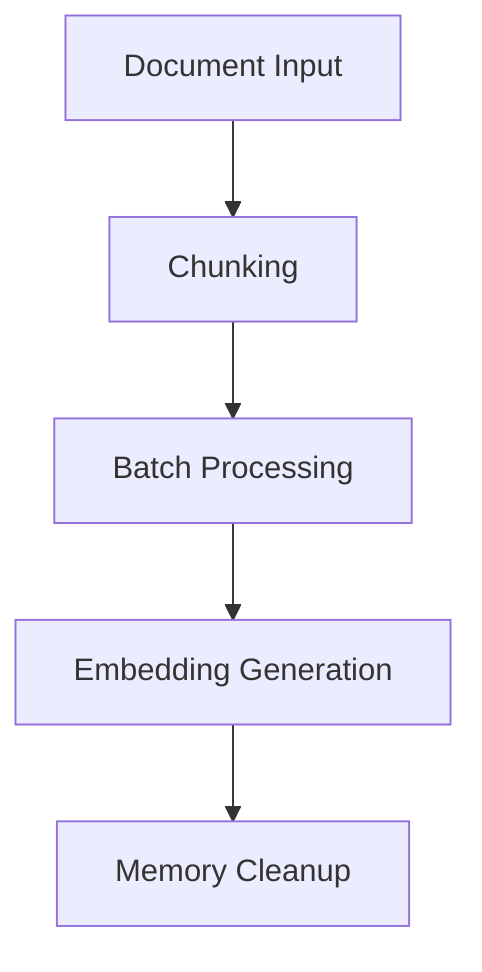

# NanoSage Technical Context

## Technology Stack

### Core Technologies
1. **Python Environment**
   - Python 3.8+
   - Async/await support
   - Type hints usage

2. **Machine Learning**
   - PyTorch for model operations
   - Transformers library for embeddings
   - Sentence-transformers for encoding
   - Numpy for numerical operations

3. **LLM Integration**
   - Ollama for model serving
   - Gemma 2B as primary model
   - Support for alternative models

4. **Web & Document Processing**
   - aiohttp for async web requests
   - DuckDuckGo search integration
   - BeautifulSoup4 for HTML parsing
   - PyMuPDF for PDF processing
   - Pytesseract for OCR
   - Pillow for image handling

## Development Setup

### Environment Requirements
```bash
# Python Setup
Python 3.8+
pip install -r requirements.txt

# Optional GPU Support
CUDA toolkit (for GPU acceleration)
PyTorch with CUDA support

# Model Setup
Ollama installation
Gemma 2B model pull
```

### Configuration System
1. **YAML Configuration**
   - Runtime settings
   - Search parameters
   - Model configurations
   - Resource limits

2. **CLI Arguments**
   - Query specification
   - Model selection
   - Device targeting
   - Search depth control

## Technical Constraints

### 1. Resource Management
- Memory limitations for embeddings
- GPU vs CPU processing
- Document batch size limits
- Text chunk size constraints

### 2. Model Constraints


- Small model focus (2B parameters)
- Local execution requirements
- Inference speed vs quality
- Memory footprint management

### 3. Search Limitations
- Web request rate limits
- Document processing caps
- Embedding batch sizes
- Result count restrictions

## Dependencies

### Core Dependencies
```plaintext
torch              # ML operations
transformers       # Model handling
sentence-transformers  # Embeddings
numpy              # Numerical ops
pyyaml             # Configuration
```

### Web & Parsing
```plaintext
aiohttp            # Async web
duckduckgo_search  # Search API
beautifulsoup4     # HTML parsing
pymupdf            # PDF handling
pytesseract        # OCR support
Pillow             # Image processing
```

### LLM Integration
```plaintext
ollama             # Model serving
```

## Performance Considerations

### 1. Memory Management


- Chunked text processing
- Batch size optimization
- Memory cleanup strategies
- Resource monitoring

### 2. Processing Optimization
- Async operations
- Parallel processing where possible
- Efficient data structures
- Caching strategies

### 3. Model Efficiency
- Quantization options
- Inference optimization
- Batch processing
- Device utilization

## Development Patterns

### 1. Code Organization
```plaintext
main.py           # Entry point
search_session.py # Core logic
knowledge_base.py # Document management
web_search.py     # Web integration
aggregator.py     # Result compilation
```

### 2. Error Handling
- Exception management
- Graceful degradation
- Recovery strategies
- Logging system

### 3. Testing Strategy
- Unit test structure
- Integration testing
- Performance benchmarks
- Error case validation

## Deployment Requirements

### 1. System Requirements
- Modern CPU (multi-core recommended)
- 8GB+ RAM recommended
- Optional GPU support
- SSD for storage

### 2. Software Dependencies
- Python environment
- Ollama installation
- CUDA toolkit (optional)
- System libraries

### 3. Network Requirements
- Internet connection for web search
- Reasonable bandwidth
- Stable connectivity

## Security Considerations

### 1. Data Handling
- Local processing focus
- No cloud dependencies
- File system isolation
- Input sanitization

### 2. Model Security
- Local model execution
- No remote API keys
- Controlled web access
- Resource limits

## Monitoring & Maintenance

### 1. Logging System
- Progress tracking
- Error reporting
- Performance metrics
- Resource usage

### 2. Health Checks
- Model status
- Resource availability
- Search functionality
- Document processing

### 3. Updates
- Dependency management
- Model updates
- Security patches
- Performance improvements

This technical context document serves as a comprehensive reference for NanoSage's technical implementation, guiding development decisions and maintenance procedures.
